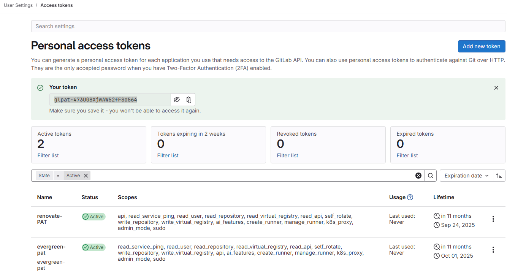

# Evergreen-Python

A Python application that mimics Renovate's Docker image update functionality, specifically designed to run within GitLab instances for automated Docker dependency updates.

## Features

- 🐳 **Docker-focused**: Specialized for Docker/Dockerfile dependency management
- 🦊 **GitLab Integration**: Native GitLab API integration for merge requests
- 🔄 **Automated Updates**: Scans for new Docker image versions and creates MRs
- 📦 **Registry Support**: Works with Docker Hub, GitLab Registry, and custom registries
- 🎯 **Simplified Configuration**: Minimal configuration compared to full Renovate
- 💾 **Caching**: Built-in caching to reduce registry API calls
- 🔐 **Authentication**: Support for registry authentication and GitLab tokens

## Quick Start

### 1. Configuration

Create a `config/renovate.json` file:

```json
{
  "enabledManagers": ["docker"],
  "access_token": "glpat-your-gitlab-token",
  "gitlab_url": "https://gitlab.example.com",
  "repositories": [
    "group/project1",
    "group/project2"
  ],
  "labels": ["dependencies", "docker"],
  "registryUrls": ["https://index.docker.io"]
}
```

### 2. Run with Docker

```bash
# Build the image
docker build -t evergreen-python .

# Run scan
docker run --rm \
  -v $(pwd)/config:/app/config \
  -e LOG_LEVEL=INFO \
  evergreen-python
```

### 3. Run with Python

```bash
# Install dependencies
pip install -r requirements.txt

# Run scan
python src/main.py --config config/renovate.json
```

## Configuration Options

### Basic Configuration

| Option | Required | Description |
|--------|----------|-------------|
| `enabledManagers` | Yes | Must be `["docker"]` |
| `access_token` | Yes | GitLab personal access token |
| `gitlab_url` | Yes | GitLab instance URL |
| `repositories` | Yes | List of repositories to scan |

### Optional Configuration

| Option | Default | Description |
|--------|---------|-------------|
| `schedule` | None | Cron schedule for automated runs |
| `automerge` | `false` | Auto-merge updates (not implemented) |
| `createMRs` | `true` | Create merge requests for updates |
| `labels` | `[]` | Labels to add to merge requests |
| `assignees` | `[]` | Assignees for merge requests |
| `registryUrls` | `["https://index.docker.io"]` | Docker registries to use |

### Host Rules (Registry Authentication)

```json
{
  "hostRules": [
    {
      "hostType": "docker",
      "matchHost": "registry.gitlab.com",
      "username": "gitlab-ci-token",
      "password": "$CI_JOB_TOKEN"
    },
    {
      "hostType": "docker",
      "matchHost": "private-registry.com",
      "username": "user",
      "password": "password"
    }
  ]
}
```

## Environment Variables

You can configure the application using environment variables instead of a config file:

```bash
export GITLAB_ACCESS_TOKEN="glpat-your-token"
export GITLAB_URL="https://gitlab.example.com"
export REPOSITORIES="group/project1,group/project2"
export LABELS="dependencies,docker"
export LOG_LEVEL="INFO"
export CACHE_DIR="/tmp/evergreen-cache"
export CACHE_TTL="3600"
```

## Command Line Usage

```bash
# Scan all configured repositories
python src/main.py

# Scan specific repositories
python src/main.py -r group/project1 -r group/project2

# Use custom config file
python src/main.py --config /path/to/config.json

# Dry run (no merge requests created)
python src/main.py --dry-run

# Help
python src/main.py --help
```

## Supported Dockerfile Patterns

Evergreen-Python can detect and update Docker images in:

- `FROM` instructions: `FROM node:16-alpine`
- `COPY --from` instructions: `COPY --from=builder:latest /app /app`
- `RUN --mount=from` instructions: `RUN --mount=from=redis:6-alpine`
- Multi-stage builds with stage names
- Images with digests: `FROM node:16@sha256:abc123...`
- Variable resolution: `FROM ${BASE_IMAGE:-node:16}`

## Versioning Logic

The application follows Docker-specific versioning patterns:

- **Semantic Versioning**: `1.2.3`, `v1.2.3`
- **Date-based**: `2023-01-01`, `20230101`
- **Calendar Versioning**: `23.1`, `2023.1`
- **Stability Levels**: Prefers stable over rc/beta/alpha

Update types:
- **Major**: `1.x` → `2.x`
- **Minor**: `1.2.x` → `1.3.x`
- **Patch**: `1.2.3` → `1.2.4`
- **Pin**: No version → pinned version

## GitLab Integration

### Permissions Required

Your GitLab access token needs:
- `api` scope for full API access
- `read_repository` for reading Dockerfiles
- `write_repository` for creating branches and commits

### Merge Request Features

- Automatically creates branches with descriptive names
- Groups updates by dependency
- Adds configured labels and assignees
- Provides detailed descriptions with change summaries
- Links to registry/documentation when available

## Deployment Options

### GitLab CI/CD

```yaml
# .gitlab-ci.yml
evergreen:
  image: evergreen-python:latest
  script:
    - python src/main.py
  variables:
    GITLAB_ACCESS_TOKEN: $EVERGREEN_TOKEN
    GITLAB_URL: $CI_SERVER_URL
    REPOSITORIES: "group/project1,group/project2"
  rules:
    - if: $CI_PIPELINE_SOURCE == "schedule"
```

### Kubernetes CronJob

```yaml
apiVersion: batch/v1
kind: CronJob
metadata:
  name: evergreen-python
spec:
  schedule: "0 2 * * MON"  # Weekly on Monday at 2 AM
  jobTemplate:
    spec:
      template:
        spec:
          containers:
          - name: evergreen
            image: evergreen-python:latest
            env:
            - name: GITLAB_ACCESS_TOKEN
              valueFrom:
                secretKeyRef:
                  name: evergreen-secrets
                  key: gitlab-token
            - name: GITLAB_URL
              value: "https://gitlab.example.com"
            - name: REPOSITORIES
              value: "group/project1,group/project2"
          restartPolicy: OnFailure
```

## Architecture

```
evergreen-python/
├── src/
│   ├── core/                    # Core business logic
│   │   ├── config_manager.py    # Configuration parsing
│   │   ├── dockerfile_parser.py # Dockerfile dependency extraction
│   │   ├── docker_registry.py   # Registry API client
│   │   └── version_manager.py   # Version comparison logic
│   ├── platforms/               # Platform integrations
│   │   └── gitlab_client.py     # GitLab API client
│   ├── utils/                   # Utilities
│   │   ├── logging.py           # Logging configuration
│   │   └── cache.py             # Simple file-based cache
│   └── main.py                  # Application entry point
├── config/
│   └── renovate.json           # Configuration file
├── tests/                      # Test files
├── Dockerfile                  # Container image
└── requirements.txt           # Python dependencies
```

## Differences from Renovate

### Simplifications
- **Single Manager**: Only Docker/Dockerfile support
- **Single Platform**: GitLab-only (no GitHub, Bitbucket)
- **Minimal Config**: Simplified configuration options
- **Local Deployment**: Runs within same GitLab instance
- **Basic Versioning**: Docker versioning only

### Optimizations for GitLab
- Native GitLab API integration
- Optimized for GitLab CI/CD workflows
- Simplified authentication model
- Reduced resource requirements

## Contributing

1. Fork the repository
2. Create a feature branch
3. Make your changes
4. Add tests for new functionality
5. Submit a merge request

## License

This project is licensed under the MIT License. See LICENSE file for details.

## Support

- 📚 **Documentation**: Check this README and inline code comments
- 🐛 **Issues**: Report bugs via GitLab issues
- 💡 **Feature Requests**: Suggest improvements via GitLab issues
- 🔧 **Support**: Check logs with `LOG_LEVEL=DEBUG` for troubleshooting

## Personal Access Token
  1. Go to http://host.docker.internal/-/user_settings/personal_access_tokens
  2. Create token with scopes: api, read_repository, write_repository
  3. Copy the glpat- prefixed token
